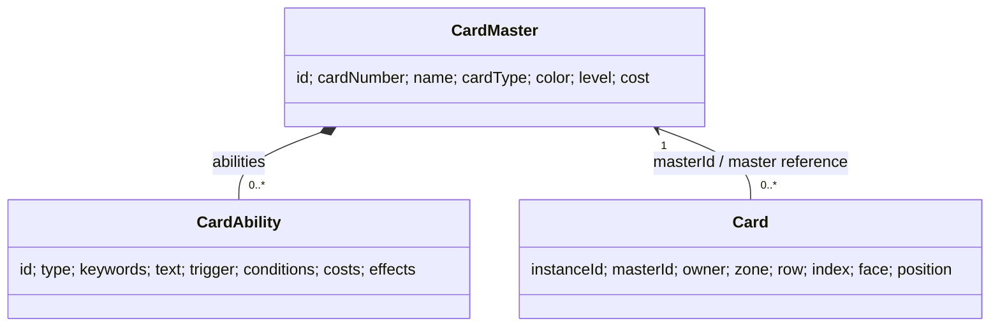

# CardMaster / CardAbility 設計書

## 目的と適用範囲

本書は、カード種類の固定データ、対戦中のCard instance、CardAbilityを将来分離・実装するための設計基準を定義する。現時点では`CardMaster` class、`CardAbility` class、Ability Engine、正式なCardMasterデータディレクトリはいずれも未実装である。本書は実装計画であり、ゲーム実装を変更しない。

カードデータモデルの責務は次の3つに分ける。

- `CardMaster`: そのカードが何であるか。
- `CardAbility`: そのカードに何が書かれているか。
- `Card`: その対戦中、その物理的な1枚が今どうなっているか。



## F-2B実地確認用の暫定カード定義

Phase F-2BのLevel・Color・Cost条件を実画面で確認するため、`client/data/test-cards.json` に固定情報だけを持つ暫定カード定義を置く。開発用ローダーは定義を検証し、既存の`Card` constructorへ固定情報とowner・zone等の初期状態を渡して、独立したCard instanceからDeckを生成する。

JSONの`id`は暫定的な定義識別子である。複数枚を生成する際はowner・定義ID・copy番号から一意な`Card.id`を作るが、`masterId`は導入しない。このJSON schemaを最終仕様とはせず、F-3CでCardMaster JSON schemaへ移行する。

## 現在のCard実装

現在の`client/js/models/card.js`の`Card`は、1枚の物理カードの状態に加えて、固定情報も同居して保持している。

```js
{
  id, name, cardType, level, cost, color,
  basePower, baseSoul, trigger, traits, text,
  owner, zone, row, index, face, position,
  currentPower, currentSoul, visibilityOverride,
}
```

- `id`は現在、Card instanceを識別するIDである。
- `face`の通常値は`null`である。表裏表示はZone由来のvisibilityとviewer判定で決まり、`FACE.DOWN`だけが明示的に裏を指定する。
- `owner`、`zone`、`row`、`index`、`position`、`currentPower`、`currentSoul`、`visibilityOverride`は対戦中に変化し得る。

この現状を互換性なく変更することは本書の対象外である。

## CardMaster と将来のCard instance分離

将来は、カード種類の固定データをCardMasterとして独立させ、Card instanceは`masterId`で参照する方向とする。

```js
CardMaster {
  id,
  cardNumber,
  name,
  cardType,
  color,
  level,
  cost,
  basePower,
  baseSoul,
  triggers: [],
  traits: [],
  flavorText,
  abilities: [],
}

Card {
  instanceId,
  masterId,
  owner,
  zone,
  row,
  index,
  face,
  position,
  currentPower,
  currentSoul,
  visibilityOverride,
}
```

同じCardMasterから複数のCard instanceを作れる。デッキに同じカードを4枚入れる場合、CardMasterは1定義、Card instanceは4枚とする。固定情報を各Cardへコピーする方向にはしない。

### F-3Aの互換getter方針

F-3AではCardがCardMasterを参照し、既存のGameEngineやRendererが利用する公開APIをgetterで維持する。

```js
card.instanceId // 対戦中の一意ID
card.masterId   // CardMaster.id
card.id         // 互換getter。instanceIdを返す

card.name       // card master.name
card.cardType   // card master.cardType
card.level      // card master.level
card.cost       // card master.cost
card.color      // card master.color
card.basePower  // card master.basePower
card.baseSoul   // card master.baseSoul
```

Cardは実行時に解決済みCardMaster参照を持つ方針とし、GameEngineがCardMaster registryを都度探索しない構造を優先する。`masterId`は保存・通信・DeckDefinitionとの接続に使う。CardMasterの固定配列やAbilityをCard instanceごとに複製・変更しない。

`currentPower`と`currentSoul`の初期値はCardMasterの基本値から生成するが、その後はCard instanceの可変状態である。RendererはF-3DでCardのgetterを通じて固定情報を表示し、CardMasterの保存形式へ直接依存しない。

### 移行上の未確定事項

- CardMaster registryの所有者、ロード完了タイミング、重複ID時の扱い
- `trigger`（現行Cardの配列）とCardMasterの`triggers`の対応
- `text`と`flavorText`の保存形式
- 既存`toJSON()` / `fromJSON()`の通信形式の互換性
- CardMasterのロード・キャッシュ・検証方法
- 将来CardMasterが持つ画像情報は、右カード詳細を描画するRendererへ供給する。画像プロパティ名と保存先は現時点では確定せず、現在のCardへは追加しない

CardMasterは対戦Card instanceとは分離し、Repository内データとして管理する方向である。保存場所はF-3Cで決定し、将来JSON、DB、APIへ移行可能な読み出し境界を設ける。

DeckDefinitionはCardMaster全文ではなく`masterId + count`を保持し、対戦開始時にCard instanceへ展開する。画面フローと外部Import境界は[Application Flow / Deck設計](application-flow.md)を正本とする。

## CardAbility

将来のCardMasterが持つAbility定義は次の構造を基本とする。

```js
CardAbility {
  id,
  type,
  keywords: [],
  text,
  trigger,
  conditions: [],
  costs: [],
  effects: [],
}
```

- `type`: Ability種別。
- `keywords`: 能力の分類・UI補助・ルール補助に使う任意の複数キーワード。
- `text`: 表示用の原Ability文章。構造化データから逆生成しない。
- `trigger`: 主にAUTOが開始するゲームイベント。
- `conditions`: 成立条件。複数ある場合は基本AND。
- `costs`: Ability使用/解決のためのCost。
- `effects`: Cost支払い後に順番に解決するEffect。

### Ability Type

`ABILITY_TYPE`は将来追加する定数であり、現在は未実装である。

| Type | 責務 |
| --- | --- |
| `CONTINUOUS` | 状態を継続評価する。 |
| `AUTO` | Game Eventを検知し、Triggerに応じて開始する。 |
| `ACT` | プレイヤーが任意に選択して使用する。 |

TypeとKeywordは別概念である。例えば【起】集中は`type: ACT`、`keywords: [BRAINSTORM]`、【自】チェンジは`type: AUTO`、`keywords: [CHANGE]`となる。BRAINSTORM、CHANGE、ACCELERATE、CX_COMBO、SUPPORTは将来候補であり、網羅的なKeyword定義は未確定である。

## Trigger / Condition / CardFilter

### Trigger（将来設計）

Triggerは主にAUTO Abilityが反応するGame Eventを表す。

```js
{ type: TRIGGER_TYPE.CARD_MOVED, from: ZONE.HAND, to: ZONE.STAGE }
{ type: TRIGGER_TYPE.PHASE_STARTED, phase: PHASE.CLIMAX }
```

`TRIGGER_TYPE`は未実装である。v1候補は`CARD_MOVED`、`PHASE_STARTED`、`ATTACK_DECLARED`、`CARD_REVERSED`、`DAMAGE_RESOLVED`だが、今回確定・実装するものではない。

### Condition（将来設計）

ConditionはAbilityの成立条件を表し、`conditions[]`の複数要素は基本ANDで評価する。

```js
[
  { type: CONDITION_TYPE.SELF_POSITION, row: "front" },
  { type: CONDITION_TYPE.TURN_PLAYER, player: "opponent" },
]
```

ORやネストした論理式は未確定である。必要になるまで汎用論理式エンジンを導入しない。

### CardFilter（将来設計）

対象カード条件は共通CardFilterとして再利用する方向である。

```js
{
  cardType: "character",
  traitsAny: ["能力者"],
  maxLevel: 1,
  owner: "self",
}
```

SEARCH_DECK、SELECT_CARD、COUNT_CARDS、Condition、Cost、Effectで共有することを想定する。Filterの全項目や評価優先順位は未確定である。

## Ability Cost

Ability Costはカードそのものをプレイする基本Costとは別であり、将来の`CardAbility.costs[]`に置く。

| v1 Cost Type | 支払い可能条件 | 支払い |
| --- | --- | --- |
| `PAY_STOCK` | `player.stock.length >= amount` | Stock Top（配列末尾）からamount枚をWAITING_ROOMへ移動する。 |
| `REST_SELF` | 発生源CardがSTAGEにあり、`position === POSITION.STAND` | 発生源Cardを`POSITION.REST`へ変更する。 |

`COST_TYPE`は現時点では未実装である。将来候補のDISCARD_HAND、DISCARD_HAND_MATCHING、MOVE_SELF_TO_WAITING_ROOM、MOVE_DECK_TOP_TO_CLOCKを今回のv1 Costには含めない。

### canPay と pay の分離

Abilityに複数Costがある場合は、全Costの支払い可能性を先に確認する。

```text
canPayAbilityCosts(card, ability, gameState)
  ↓ 全Costを検証
使用可否 / disabledReason
  ↓ 実行直前に再検証
payAbilityCosts(card, ability, gameState)
```

一つでも支払えなければ使用不可とする。全Costが支払い可能であることを確認してから順に支払うことで、部分支払いを防ぐ。ACT UIは使用可能なら通常ボタン、不可ならdisabled/grayとし、将来は「ストックが足りません」「このカードはすでにレストしています」などの理由を返せる形を想定する。

## Effect と Process / Rule Check

Abilityの`effects[]`は「何をするか」を表すデータであり、Effect ExecutorまたはProcessが「どの手順で実行するか」を担当する。

```js
effects: [
  { type: EFFECT_TYPE.REVEAL_FROM_DECK, count: 4 },
]
```

意味上1つのEffectでも、途中でdeckが空になればCheck Pointが必要になり得る。EffectデータをCheck Pointごとに不必要に分割せず、Executor Processがstepを保存して処理する。

```text
Effectの1枚処理
  ↓ resume stepを保存
resolveRuleCheck()
  ↓ REFRESH / REFRESH_PENALTY / LEVEL_UP等の割り込み
completeCurrentProcess()
  ↓
元Effect Processを保存済みstepから再開
```

これは現在のDRAW_PHASE、CLOCK_PHASE、REFRESH、REFRESH_PENALTY、LEVEL_UPの中断・再開規約を再利用する。RendererはAbility RuleやEffectの妥当性を判断しない。

Effect Type候補はMOVE_CARD、DRAW、LOOK_AT_DECK、REVEAL_FROM_DECK、SELECT_CARD、SEARCH_DECK、SHUFFLE、MODIFY_POWER、MODIFY_SOUL、GRANT_ABILITYである。全種別の実装・確定は将来対応とする。

## Value（将来設計）

固定値と動的値を共通表現する方向を検討する。

```js
{ type: VALUE_TYPE.FIXED, value: 1500 }

{
  type: VALUE_TYPE.CARD_COUNT,
  zone: ZONE.STAGE,
  filter: { traitsAny: ["能力者"] },
  multiplier: 500,
}
```

これにより固定Power +1500と、特定trait1枚につきPower +500を同じEffect形で扱える。`VALUE_TYPE`とValue評価エンジンは未実装である。

## Optional / Choice（未確定）

「コストを払ってよい」「〜してよい」「1枚まで選ぶ」にはoptionalまたはChoiceを表す構造が必要である。どの層が選択状態を保持し、Process contextへ何を保存するかは未確定とする。

## ACT Ability v1の代表例

最初のAbility Cost/UI検証候補は「人気アイドル 西森 柚咲」（`Kch/W78-001`）の【起】集中である。

```js
{
  type: ABILITY_TYPE.ACT,
  keywords: ["BRAINSTORM"],
  text: "【起】集中 ［① このカードを【レスト】する］...",
  costs: [
    { type: COST_TYPE.PAY_STOCK, amount: 1 },
    { type: COST_TYPE.REST_SELF },
  ],
  effects: [], // 集中Effect自体は今回対象外
}
```

この例はPAY_STOCK、REST_SELF、ACTボタンの有効/無効判定を検証する代表例であり、集中Effectの実装を意味しない。

## v1対象外・残課題

- CardMaster/CardAbility classとカードデータ登録
- Ability Engine、Cost Executor、Effect Executor
- AUTO Trigger System、CONTINUOUS evaluator
- ACT Effectの実行
- Option/Choiceの詳細設計
- Trigger/Condition/CardFilter/Valueの定数と評価器
- DB/API/JSONによるCardMaster供給
- 現在のCard固定情報からmasterId参照へ移行する手順

## F-3実装順

1. **F-3A**: CardMasterを導入し、Cardから固定情報を分離する。互換getterにより既存GameEngine APIを維持する。
2. **F-3B**: CardAbilityのデータ構造を導入する。Ability Engineは含めない。
3. **F-3C**: CardMaster JSON schemaとローダーを導入し、暫定`test-cards.json`を移行して実カード数枚を追加する。
4. **F-3D**: Rendererとカード詳細をCard getter / CardMaster参照へ統一する。
