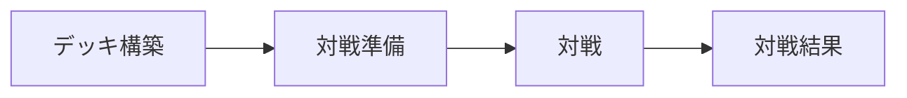
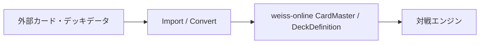

# Application Flow / Deck設計

## 目的と範囲

カードデータがデッキ構築から対戦結果までどう受け渡されるかを定義する。F-3CでDeckDefinitionと対戦用Deckへの展開を実装済みであり、デッキ構築画面、MatchResult、外部Importはまだ実装しない。

## 画面フロー



### デッキ構築

CardMaster一覧からカードを選び、CardMaster全文を複製せず`masterId + count`をDeckDefinitionへ保存する。

```js
DeckDefinition {
  id,
  name,
  cards: [
    { masterId, count },
  ],
}
```

デッキ構築ルール、永続化方式、ユーザー所有カードの扱いは未確定とする。

### 対戦準備

使用Deck、対戦相手、Room / Matchを選択・作成する。オンライン同期やRoomの詳細仕様は、通信実装時に確定する。

### 対戦開始

```text
DeckDefinition + CardMaster registry
  ↓ masterIdを解決
対戦ごとに一意なCard instanceを必要枚数生成
  ↓
Deck
  ↓
GameState
```

Card instanceは対戦ごとに新規生成し、異なる対戦やDeck位置で同じobjectを共有しない。固定情報はCardMasterを参照し、owner、zone、position等はCardが保持する。

### 対戦結果

将来の`MatchResult`はwinner、players、使用deck、開始時刻、終了時刻等を保持する可能性がある。履歴、リプレイ、詳細ログの保存範囲は未確定とする。

## 外部デッキ・カードデータ境界

外部サービスのschemaを内部CardMaster schemaとして採用しない。



外部形式のURL、field名、欠損値、仕様変更はImporterで吸収する。GameEngine、Card、Rendererは外部schemaを参照しない。権利・利用規約・再配布条件の確認もImport導入時の必須事項とする。

## F-3Cの開発用データ

`client/data/card-masters.json`は正式なCardMaster schema、`client/data/test-decks.json`は開発用DeckDefinitionである。Loaderが両者を取得し、RegistryによるmasterId解決後にself / opponentそれぞれの独立したCard instanceへ展開する。開発用Definitionは50枚になるが、DeckDefinitionモデル自体は50枚ルールを判定しない。

CardMaster / Card / CardAbilityの詳細は[カードデータ設計](カードデータモデル.md)を正本とする。
