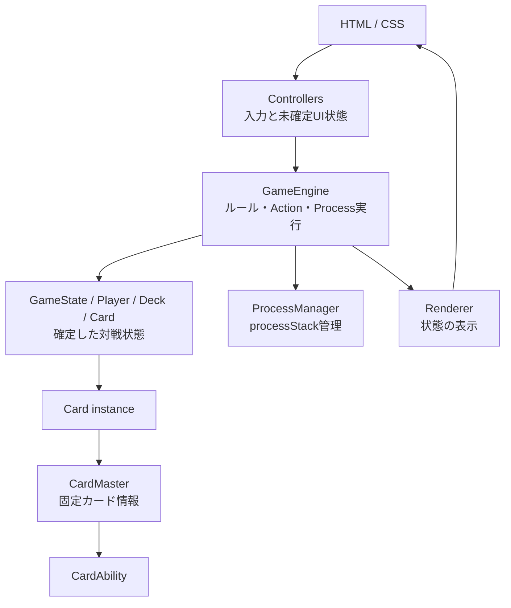

# プロジェクト全体Architecture

## 目的

weiss-onlineの現在の責務分担と、F-3以降にカードデータ層を追加した後の依存方向を定義する。個別のProcessやカードAbility schemaは、それぞれの専門設計書を正本とする。

## レイヤーと責務

- `GameState`: プレイヤー、ターン、フェイズ、ログ、勝敗、ルール処理状態の正本。
- `GameEngine`: GameStateを読み、ルール判定、確定Action、Process開始・再開を行う。
- `ProcessManager`: `gameState.ruleState.processStack`のpush/popとstep/status更新だけを行う。ルール判断はしない。
- `Controllers`: クリック・タップを受け、未確定の選択や確認UIをローカルに保持してGameEngineへ渡す。
- `Renderer`: GameStateとCardの公開APIをDOMへ反映する。ルール判断や状態変更はしない。
- `CardMaster`: カード種類に共通する固定情報の正本。F-3Aで導入済み。
- `Card`: 対戦ごとに生成される1枚の状態。F-3A以降はCardMasterを参照する（実装済み）。
- `CardAbility`: カードに記載された能力の表示情報と構造化ルール情報。F-3Bで導入する。

## 依存ルール

1. DOMをGameStateの代わりにしない。
2. ControllerとRendererへゲームルールを置かない。
3. ProcessManagerへ個別ルールや優先順位を置かない。
4. GameEngineはCardMasterの保存形式や外部サイトschemaへ直接依存せず、Cardの公開APIを利用する。
5. Cardデータの正本と対戦中の可変状態を分離する。
6. Check Pointでは再開stepを保存してからRule Checkを実行する。

## 現在からF-3への変化

F-3AでCardMasterを追加し、Cardをinstance状態へ絞った。一方、既存GameEngine・Rendererへの影響を抑えるため、`card.name`、`card.level`、`card.cost`等の公開APIはCardのgetterで維持する。

詳細は[CardMaster / CardAbility設計](カードデータモデル.md)、対戦Processは[Process設計](プロセス.md)、MAIN Actionは[MAIN Phase設計](メインフェイズ.md)を参照する。

## 将来のオンライン対戦・再接続境界

オンライン対戦でブラウザ更新やクラッシュが発生した場合は、将来のサーバー上の確定済み`GameState`を正とする。再接続時は`GameState`、Card runtime state、turn / phase、再開に必要なProcess状態を復元し、`CardMasterRegistry`は必要なmasterを再読み込みして再構築する想定とする。

一方、選択中カード、hover、未確定のUI選択などControllerが持つUI-local stateは原則として復元対象にしない。通信プロトコル、サーバー保存、再接続処理自体は将来予定であり、F-3Aの対象外とする。
