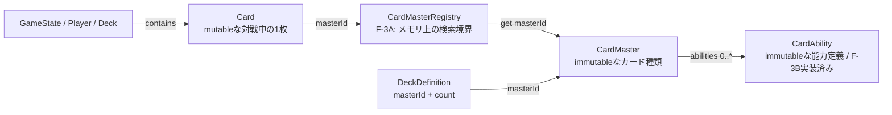

# エンティティ・オブジェクト一覧

## 目的と読み方

本書は、対戦ドメインの主要なEntity / Data Objectと、それらを操作・表示するService / Componentの責務境界を一覧にする。「実装済み」は現在のリポジトリに対応するクラスが存在することを示す。F-3Bまで実装済みである。詳細なカードデータ仕様は[カードデータモデル](カードデータモデル.md)を正本とする。

## Entity / Data Object

| 物理名 | 論理名 | 分類 | 主な役割 | mutable / immutable | 主な保持先・管理主体 | 現在の実装状況 |
| --- | --- | --- | --- | --- | --- | --- |
| `CardMaster` | カードマスター | Data Object | 「そのカードが何であるか」を表し、0件以上の`CardAbility`を直接包含する固定情報 | immutable | `CardMasterRegistry`がメモリ上で管理 | **F-3B更新済み** |
| `CardAbility` | カード能力定義 | Data Object | 表示原文と将来処理用の構造化データを持ち、runtime状態は持たない | nested構造を含めimmutable | `CardMaster.abilities[]`に直接包含 | **F-3B実装済み** |
| `Card` | 対戦中カードインスタンス | Entity | 「その対戦中、その1枚が現在どうなっているか」を表す | mutable | `Deck`または`Player`の各Zone。`GameState`から到達可能 | **F-3A実装済み**。`instanceId` / `masterId`を分離し、固定情報は互換getterで参照 |
| `DeckDefinition` | デッキ定義 | Data Object | `masterId + count`で対戦開始前のデッキ構成を表す | immutableとして扱う | 将来のデッキ構築・対戦準備境界 | **概念設計**。未実装 |
| `Deck` | 山札 | Entity / Collection | 順序付き`Card` instanceとdraw / shuffle等の基本操作を管理 | mutable | `Player.deck` | **実装済み** |
| `Player` | プレイヤー状態 | Entity | プレイヤー情報と山札・手札・舞台等のZoneを保持 | mutable | `GameState.players` | **実装済み** |
| `GameState` | 対戦状態 | Entity / Aggregate | プレイヤー、ターン、フェイズ、ルール処理状態、勝敗、ログなど確定済み対戦状態の正本 | mutable | `GameEngine`が更新し、`Renderer` / Controllerが参照 | **実装済み** |

## Service / Component

| 物理名 | 論理名 | 分類 | 主な役割 | mutable / immutable | 主な保持先・管理主体 | 現在の実装状況 |
| --- | --- | --- | --- | --- | --- | --- |
| `CardMasterRegistry` | カードマスターレジストリ | In-memory Registry | 読み込み済み`CardMaster`を`masterId`で登録・取得する | Registryの登録集合はmutable、登録するmasterはimmutable | アプリケーションの対戦準備境界で構築 | **F-3A実装済み**。永続ストレージではない |
| `GameEngine` | ゲームエンジン | Domain Service | ルール判定、確定Action、`GameState`更新、Process開始・再開 | mutableな`GameState`を操作 | アプリケーション起動時に構築 | **実装済み**。F-3A後も保存形式やJSONへ直接依存しない |
| `ProcessManager` | プロセス管理 | Domain Service | 中断・入力待ちを含むProcess stackの開始・取得・完了 | mutableな`GameState.ruleState.processStack`を操作 | `GameEngine`が保持 | **実装済み** |
| `Renderer` | 画面描画 | View Component | `GameState`と`Card`公開APIをDOMに反映する。ルール判断・状態変更はしない | 内部にDOM参照を持つがドメイン状態を変更しない | `GameEngine`から再描画要求を受ける | **実装済み**。CardMaster対応は**F-3D予定** |
| `*Controller` | UIコントローラー群 | UI Component | DOM eventを受け、操作可否を`GameEngine`に問い合わせ、確定操作を委譲。選択中・hover等のUI-local stateを保持 | UI-local stateはmutable | 各Controller instance | **実装済み**。一時UI状態は`GameState`の正本にしない |

## カードデータの関係

- `CardMaster`はカード種類ごとに1つ、`Card`は対戦で使う物理カードごとに1つ生成する。同じmasterの4枚は、1つの`CardMaster`と4つの`Card` instanceになる。
- `CardAbility`は能力の定義であり、対戦中の位置や現在パワーを持たない。
- `DeckDefinition`は`CardMaster`全文や`Card` instanceを保存せず、`masterId + count`だけを持つ。対戦開始時に、解決済みmasterと独立したinstance IDを持つ`Card`へ展開する。

## F-3Aで導入したRegistry境界

`CardMasterRegistry`のAPIは`register(master)`、`get(masterId)`、`has(masterId)`、`getAll()`とする。これは読み込み済みmasterを参照するためのメモリ上のRegistryであり、永続ストレージやRepositoryではない。ブラウザ再読み込み後は必要なmasterを取得して再構築する。

取得元が将来`JSON → API → DB`と変わっても、`Card`や`GameEngine`は取得元・JSON schemaへ直接依存しない。`Card`は解決済み`CardMaster`への参照と`masterId`を持ち、既存の固定情報APIはgetterで提供する方針とする。
