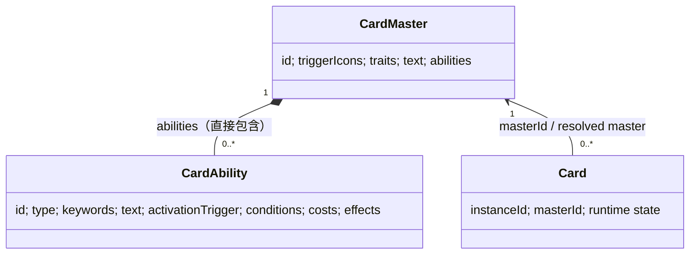
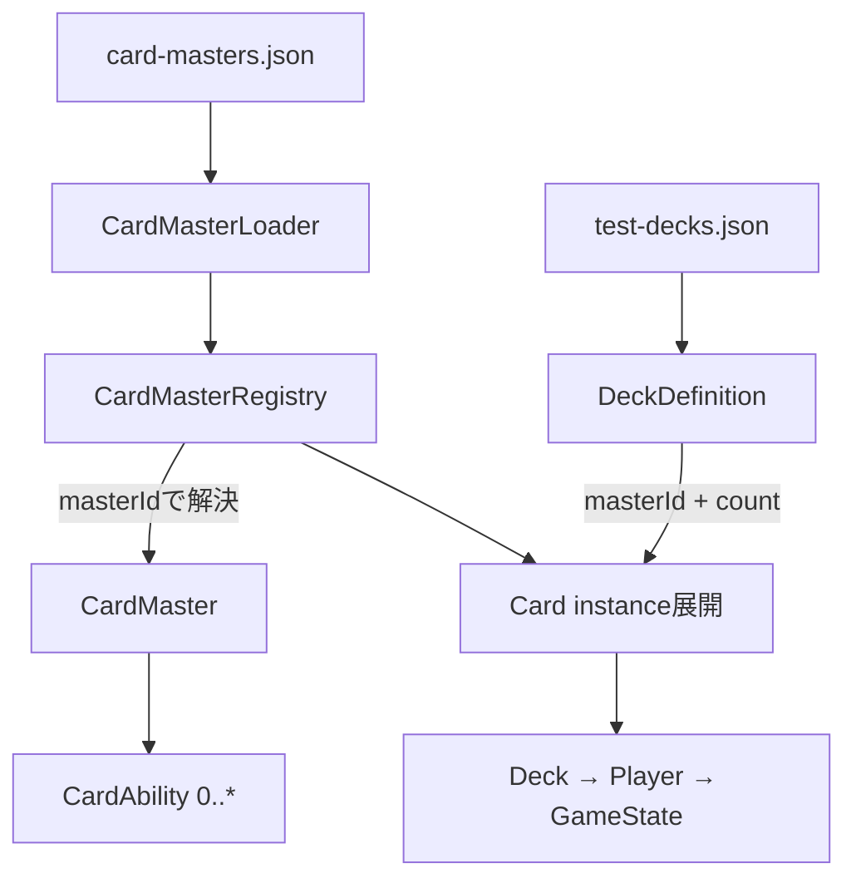

# CardMaster / CardAbility 設計書

## 目的と現在地点

カードデータを「そのカードが何であるか」を表すimmutableな`CardMaster`、「そのカードに何が書かれているか」を表すimmutableな`CardAbility`、対戦中のmutableな1枚である`Card`に分離する。F-3Cまで実装済みで、次PhaseはF-3D（Renderer / カード詳細のMaster参照整理）である。



## CardMaster

`CardMaster`はカード種類ごとの固定情報であり、本体、`triggerIcons`、`traits`、`abilities`をfreezeする。`abilities`を省略した場合は空配列となる。`CardAbility` instanceとplain objectの双方を受け入れ、plain objectはconstructor境界で`CardAbility`へ変換する。これによりF-3CのJSON loaderへ自然に接続しつつ、不正データをsilentに保持しない。fetchはモデルの責務ではない。

`CardMaster.abilities`はCardAbility IDだけを持つ外部参照ではなく、`CardAbility[]`を直接包含する。CardAbility Registryは設けない。同一CardMaster内で`CardAbility.id`が重複した場合は生成時にErrorとする。別CardMaster間の同じIDは許可する。

`triggerIcons`はカード自体に印刷されたトリガーアイコンの正式名である。値は`TRIGGER_ICON`で定義し、未知値は生成時に拒否する。アイコンなしは`[]`、同種2個は`["SOUL", "SOUL"]`で表し、`NONE`は定義しない。F-3A互換の`CardMaster.triggers`別名と、`card.trigger` / `card.triggers` getterは残す。新APIは`card.triggerIcons`である。

`CardMaster.text`はlegacy / transitionalな固定情報としてF-3Bでも残し、flavor textへ意味変更しない。扱いはF-3Cで再検討する。

## CardAbility

```js
CardAbility {
  id,
  type,               // CONTINUOUS | AUTO | ACT
  keywords: [],
  text,
  activationTrigger,  // null または構造化データ
  conditions: [],
  costs: [],
  effects: [],
}
```

`ABILITY_TYPE`は`CONTINUOUS`（【永】）、`AUTO`（【自】）、`ACT`（【起】）の英語固定値であり、未知のtypeは生成時に拒否する。日本語表示とは分離する。`id`は包含するCardMaster内でのみ一意でよい。

`text`は人間が読む能力原文・表示用であり、GameEngineが解析して処理を決めてはならない。`activationTrigger`、`conditions`、`costs`、`effects`は将来のGameEngine向け構造化データを保持する枠である。F-3Bでは具体的なTrigger / Condition / Cost / Effect type、評価器、executorを定義しない。`activationTrigger`はnullを許容し、CardMasterの`triggerIcons`とは別概念である。

CardAbilityは入力されたplain object / arrayを再帰的にcopyしてfreezeし、本体もfreezeする。したがって配列、nested object、constructorへ渡した元データの後続変更から独立する。`used`、`activated`、`resolved`、`oncePerTurnUsed`等のruntime状態は持たず、必要になればCard / GameState / Process側で管理する。

同種能力を持つ複数カード間でCardAbility objectを共通マスターとして共有する設計にはしない。将来共通化する対象は`PAY_STOCK`等の処理タイプと実行処理であり、その実装はF-4以降とする。

## Cardとserialization

Cardは解決済みmasterを参照し、`card.abilities`はコピーせず`master.abilities`を返す。`currentPower`等のruntime stateだけがCard側でmutableである。

`Card.toJSON()`は`instanceId`、`masterId`、owner、zone、表示・位置、現在Power/Soulだけを保存する。abilities、能力text、activationTrigger、conditions、costs、effectsは埋め込まない。`Card.fromJSON(data, registry)`は`masterId`をRegistryで解決するため、復元後もmasterのabilitiesを参照できる。

## F-3C完成時のデータフロー



`id`はweiss-online内部のMaster ID、`cardNumber`は実カード番号であり別概念とする。Loaderだけが取得・基本形式検証・ドメイン変換を担当するため、将来JSONをDB/APIへ交換してもCard、GameEngine、Rendererは保存形式やfetchへ依存しない。

`DeckDefinition`は`id`、`name`、`{ masterId, count }[]`だけをimmutableに保持し、入力からdeep copyする。50枚、同名枚数、クライマックス枚数等の構築ルールは判定しない。展開時にRegistryでmasterをfail-fastに解決し、各owner・各copyに一意な`instanceId`を持つCardを生成する。CardMasterは共有するがCard instanceは共有しない。

## 非対象

F-3Cはデータ供給・保持・展開のみを対象とする。Ability / Cost / Effect / Trigger executor、activation queue、effectQueue接続、ProcessManager連携、能力UI、実カード能力の解決は実装せず、F-4以降に扱う。
