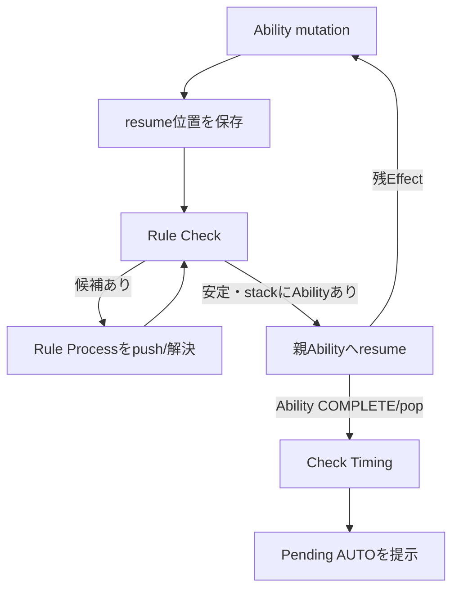

# 複合コスト・山札検索AUTO 詳細設計

## 1. 目的と責務

本書は個別カード説明ではなく、登場時等の任意AUTOが複数Costを払い、Rule処理後に山札を0～N枚検索し、移動後のRule処理を挟んで残処理へ復帰する再利用可能な処理パターンの正本である。Game Event、Trigger Detection、Pending AUTO、masterPlayer、使用/不使用は[「AUTO能力共通」](../AUTO能力共通.md)を正本とし、本書はCost boundary、Effect途中のCheck Point、SEARCH_DECK、interrupt/resumeだけを扱う。

採用ルールは **ver.1.112**。根拠は8.4（Cost）および9章のRule処理・Check Timingであり、要旨は[ルール参照メモ](../../../../../ルール参照/ヴァイスシュヴァルツ総合ルール_ver1.112.md)を参照する。

## 2. 対象パターン

```text
登場時等のAUTO → 任意Costを使用 → Cost item 1 → item 2 … → Cost全体完了
→ Rule Check安定化 → SEARCH_DECK(0～N) → Hand等へ移動
→ Rule Check安定化 → shuffle等の残Effect → AUTO完了 → Check Timing
```

代表実装は`CHA/W40-026SP`「“大切な何か”乙坂 歩未」PRINTED AUTO②だが、定義・設計名をカードIDに固定しない。

## 3. Cost payment boundary

全項目を現在Stateで先に支払えるか検証する。Deck 1 / Waiting Room 0は、Stockを先にWaiting Roomへ移すので使用不能理由ではない。commit後は次の不可分な境界とする。

```text
Cost item 1 → Cost item 2 → … → Cost全体完了 → Check Point / Rule Check
```

handlerは同期的にテキスト順でmutationするが、item間で`resolveCheckPoint()`を呼ばない。AUTO contextの`costPaymentInProgress`は境界内、`costIndex`は完了済み項目数を示す。全項目後に`CHECK_POINT_AFTER_COST`へstepを先送りしてRule Checkを開始するため、割り込み後は`RESOLVE_EFFECT`から再開しCostを二重に払わない。

## 4. Cost後のRule処理と同時成立

Deck 0またはClock 7+なら、`resolveRuleCheck()`が`REFRESH` / `LEVEL_UP`を列挙する。複数なら`pendingInterrupts`へ保存して順序選択UIを表示する。

```text
候補選択 → 選択したRule Processをpush → 完了/pop → 再Rule Check
→ 残条件を現在Stateから再列挙 → 条件なし → 保存済みAUTOへresume
```

候補配列を処理済みとみなして連続実行せず、毎回再判定する。Deck/Waiting Room敗北候補もCost途中では評価しない。解消可能なRule Processまたは保存済み能力解決がある間は保留し、それらの完了後に再評価する。

Refresh完了で発生するRefresh penalty（リフレッシュポイント処理）はRefresh本体と一体の連続stepではない。`pendingChecks`へ保持し、Refreshをpopした後の再Rule Checkで独立候補にする。したがってRefresh後もClock 7+なら、**Refresh penaltyとLevel Upを共に順序選択対象とする（ルール関係B）**。どちらを選んでも完了後に最新Stateから残候補を再列挙する。公式PDF本文は実行環境の403により枝番を再照合できず、採用版参照メモに保存済みの9章要旨を根拠とする。

## 5. Effect途中のRule Check

Costとは境界が異なる。各Effect mutation後は`effectIndex`を先に進め、`CHECK_POINT_AFTER_EFFECT`へ移してからRule Checkする。

```text
Effect mutation → Check Point → Rule Process → 再Rule Check → AUTO resume → 次Effect
```

検索カードをHandへ移してDeck 0ならRefresh、penalty、必要なLevel Upを完了後、次の`SHUFFLE_DECK`へ復帰する。先にindexを進めるためHand追加を二重実行しない。0枚選択でも検索結果は空配列として確定し、shuffleは省略しない。

## 6. Process context / resume

| 情報 | 用途 |
| --- | --- |
| `costIndex`, `costPaymentInProgress` | Cost境界と完了済みitemを監査し二重支払いを防止 |
| `effectIndex` | 次に解決するEffect。mutation前後のstep遷移と組で二重Effectを防止 |
| `effectResults` | Effect ID単位のchild結果。後続`ADD_TO_HAND`が参照 |
| `selectedCardInstanceIds` | SEARCH_DECKの選択。Card objectでなく識別子を保持 |
| parent/child Process | AUTOを下、SEARCH_DECK/Rule Processを上に積み、pop後に保存stepへ復帰 |
| `step`, `status` | 次の処理と`WAITING_INPUT`を明示 |

### 6.1 Rule ProcessとCheck Timingの境界

`resolveCheckPoint()`はRule Checkの入口でもあるが、Ruleが安定したという事実だけでPending AUTOを提示してはならない。Process stackのどの深さであっても`ACT_ABILITY`または`AUTO_ABILITY`が残っていれば、その能力は解決途中である。

1. Abilityが次の`costIndex` / `effectIndex` / `step`を保存する。
2. Check PointがRule ProcessをAbilityの上へpushする。
3. Rule Process内のCheck Pointと完了出口は、Rule候補がなくなるまでRule Checkを反復する。
4. Rule状態が安定したら、Pending AUTOをcollectionに保持したまま親Abilityをresumeする。
5. 親Abilityが`COMPLETE`になりpopされた後、初めて通常Check TimingとしてPending AUTOを提示する。

つまり **「Rule Processが終わった」≠「解決中の能力が終わった」** である。Pendingの生成・保持は能力解決中も許可する一方、提示と次のAUTO開始だけを能力完了後まで遅延する。これはAUTO②用フラグではなく、ACT/AUTO共通のProcess stack不変条件である。



## 7. SEARCH_DECK責務

1. 親がfilter、`minSelect/maxSelect`、effect IDを持つchild `SEARCH_DECK`をpushする。
2. PREPARE後は`WAIT_FOR_SELECTION / WAITING_INPUT`とし、UIは全Deckとeligibleを表示する。
3. Controllerは0～N件のinstance IDだけをEngineへ渡す。
4. confirm時に個数・重複・filter適合を再検証し、親の`effectResults`へ結果を保存する。
5. child完了後の親Check Pointを経て、`ADD_TO_HAND`が公開ログと領域移動、後続Effectがshuffleを担当する。

UIはスマホでカード領域だけをスクロールし、選択数と44px以上の決定操作をfooterとして常時確保する。PCの2カラムとResolution modalの責務は変更しない。

## 8. ACT集中との共通性と相違

Cost handler、`payCosts()`、Rule Check、Refresh/penalty、Level Up、Process stack、SEARCH_DECK child、CardSelectionViewは共通である。ACTは`ACT_ABILITY_STEP`と集中固有のReveal/Resolution確認を、AUTOはPending移管、`AUTO_ABILITY_STEP`、任意使用を所有する。相互のstepやcontextを流用して混同せず、共通処理だけをEngine/Resolverへ置く。
